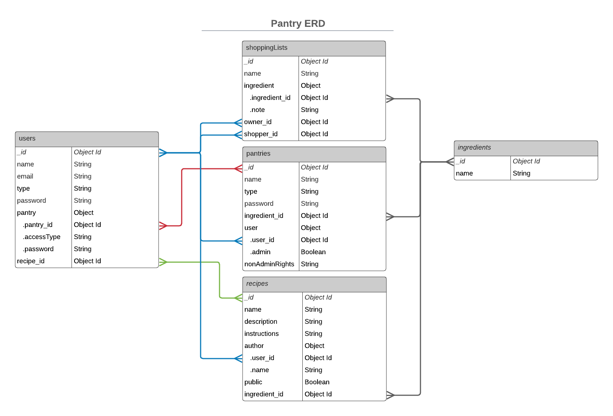

# Pantry

Manage your pantry, plan meals, and generate shopping lists!

# Project 3

### ERD

## Tasks

- Front End Components
  - AddRecipe
    - Creating a new recipe
  - CookNow
    - Query your favorited recipes to determine what you can make with the ingredients in your pantry
  - MyRecipes
    - Display a user’s favorited recipes
  - Pantry
    - Display ingredients in a pantry
  - RecipeInfo
    - Display a recipe and its details and ingredients
  - Search
    - Display search results
  - ShoppingList
    - Generate a shopping list from recipe’s ingredients
- Back End
  - Schema
  - Seed
    - Ingredients
    - categories

### Shopping List
When a shopping list is generated:
A shopping list generated locally in an object
- if user is signed in, they can save the shopping list (list is created in the database and associated with a pantry)

Shopping list generation:
Pull ingredients from recipe -> recipeIngredients
Create an empty shopping list -> shoppingList
If the user is signed in
pull ingredients from a pantry -> pantryIngredients
Iterate through recipeIngredients
If recipeIngredient is in pantryIngredients, add recipeIngredient to shoppingList
If user is not signed in, all recipeIngredients are added to shoppingList
